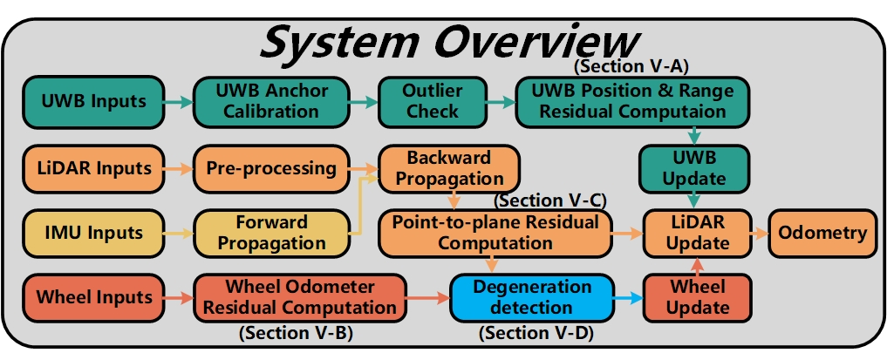

<div align="center">
    <h1><strong>CM-LIUW-Odometry<strong></h1>
    <h2><strong>Robust and High-Precision LiDAR-Inertial-UWB-Wheel Odometry for Extreme Degradation Coal Mine Tunnels</strong></h2>
    <a href="https://github.com/KJ-Falloutlast" target='_blank'>Kun Hu</a><sup>1</sup>&nbsp;&nbsp;&nbsp;
    <a href="https://orcid.org/0000-0002-2395-9543" target='_blank'>Menggang Li</a><sup>1,†</sup>&nbsp;&nbsp;&nbsp;
    <a href="https://orcid.org/0009-0008-6412-4711" target='_blank'>Zhiwen Jin</a><sup>1</sup>&nbsp;&nbsp;&nbsp;
    <a href="https://orcid.org/0000-0003-1641-9845" target='_blank'>Chaoquan Tang</a><sup>1</sup>&nbsp;&nbsp;&nbsp;
    <a href="https://orcid.org/0000-0002-3932-4542" target='_blank'>Eryi Hu</a><sup>2</sup>&nbsp;&nbsp;&nbsp;
    <a href="https://orcid.org/0000-0002-8672-2535" target='_blank'>Gongbo Zhou</a><sup>1</sup>&nbsp;&nbsp;&nbsp;
    </br></br>
    <sup>1</sup>CUMT(XuZhou)&nbsp;&nbsp;&nbsp;
    <sup>2</sup>Information Institute&nbsp;&nbsp;&nbsp;
    </br></br>
    († Corresponding author)  
</div>

<div align="center">
    <!-- <a href="https://hits.seeyoufarm.com">
        </a> -->
        <!-- <a href="https://ieeexplore.ieee.org/document/10806842"></a> -->
        <a href="http://arxiv.org/abs/"></a>

[](https://github.com/KJ-Falloutlast/CM-LIUW-Odometry/stargazers) 
[](https://github.com/KJ-Falloutlast/CM-LIUW-Odometry/fork)
[](https://github.com/KJ-Falloutlast/CM-LIUW-Odometry/issues)

<a ></a>
<a href="https://github.com/KJ-Falloutlast/CM-LIUW-Odometry/"></a>
<!-- [](https://opensource.org/licenses/MIT) -->


</div>

<p align="center">
  
  <br><em>The mapping details of CM-LIUW-Odometry and other algorithms.</em>
</p>

## :memo: Overview

Simultaneous Localization and Mapping (SLAM) in large-scale, complex, and GPS-denied underground coal mine environments presents significant challenges. Sensors must contend with abnormal operating conditions: GPS unavailability impedes scene reconstruction and absolute geographic referencing, uneven or slippery terrain degrades wheel odometer accuracy, and long, feature-poor tunnels reduce LiDAR effectiveness. To address these issues, we propose CoalMine-LiDAR-IMU-UWB-Wheel-Odometry (**CM-LIUW-Odometry**), a multimodal SLAM framework based on the Iterated Error-State Kalman Filter (IESKF). First, LiDAR-inertial odometry is tightly fused with UWB absolute positioning constraints to align the SLAM system with a global coordinate. Next, wheel odometer is integrated through tight coupling, enhanced by nonholonomic constraints (NHC) and vehicle lever arm compensation, to address performance degradation in areas beyond UWB measurement range. Finally, an adaptive motion mode switching mechanism dynamically adjusts the robot’s motion mode based on UWB measurement range and environmental degradation levels. Experimental results validate that our method achieves superior accuracy and robustness in real-world underground coal mine scenarios, outperforming state-of-the-art approaches. We open source our code of this work on Github to benefit the robotics community.

<p align="center">
  
  <br><em>The system flow of CM-LIUW-Odometry.</em>
</p>

## :memo: Updates

- \[2025.06.16\] - **CM-LIUW-Odometry** is accepted to IROS 2025. :rocket:
<!-- - \[2025.03\] -   Source code released  **🎉** -->


## 📁 Dataset
<!-- 
<table>
  <tr>
    <th style="text-align:center">Dataset</th>
    <th style="text-align:center">Full Name</th>
    <th style="text-align:center">Duration (s)</th>
    <th style="text-align:center">Distance (km)</th>
    <th style="text-align:center">LiDAR Type</th>
  </tr>
  <tr>
    <td style="text-align:center">QiSheng</td>
    <td style="text-align:center"><a href="https://pan.baidu.com/s/1FBHpDxpykGApxJESxXfk5Q?pwd=yjad" target="_blank">industrial</td>
    <td style="text-align:center">485</td>
    <td style="text-align:center">00</td>
    <td style="text-align:center">Velodyne VLP-16</td>
  </tr>
  <tr>
    <td style="text-align:center">QiSheng</td>
    <td style="text-align:center"><a href="https://pan.baidu.com/s/1uSNeHuNeXuK6kchIEvridQ?pwd=326a" target="_blank">industrial2</td>
    <td style="text-align:center">414</td>
    <td style="text-align:center">00</td>
    <td style="text-align:center">Velodyne VLP-16</td>
  </tr>
  <tr>
    <td style="text-align:center">QiSheng</td>
    <td style="text-align:center"><a href="https://pan.baidu.com/s/1uTexo8NcSUi35cqfo7LdNw?pwd=4rvc" target="_blank">park1</td>
    <td style="text-align:center">479</td>
    <td style="text-align:center">00</td>
    <td style="text-align:center">Velodyne VLP-16</td>
  </tr>
  <tr>
    <td style="text-align:center">QiSheng</td>
    <td style="text-align:center"><a href="https://pan.baidu.com/s/10kaTa2fELM-e7N3PC4sm0g?pwd=xgwm" target="_blank">park2</td>
    <td style="text-align:center">315</td>
    <td style="text-align:center">0.0</td>
    <td style="text-align:center">Velodyne VLP-16</td>
  </tr>  

</table> -->


<!-- ## 🕹️Quickly Run -->

<!-- ### Dependencies

- ceres 2.10
- opencv
- Eigen3
- yaml-cpp
  
### Usage

1. Prerequisites
   **Ubuntu and ROS**

   Ubuntu >= 18.04. And Ubuntu 20.04 is recommended.


2. **glog**
   ```bash
    sudo apt-get install -y libgoogle-glog-dev
    ```

3. build
   ```bash
    cd ~/catkin_ws/src
    git clone https://github.com/chengwei0427/Adaptive-LIO.git
    cd ..
    catkin_make
    ```


4. Run
   ```bash
    source devel/setup.bash
    roslaunch adaptive_lio run.launch
    ``` -->
   

<!-- ## Publications

If your like our projects, please cite us and support us with a star 🌟.
We kindly recommend to cite [our paper](https://ieeexplore.ieee.org/document/10806842) if you find this library useful: -->

<!-- ```latex
@ARTICLE{10806842,
  author={Zhao, Chengwei and Hu, Kun and Xu, Jie and Zhao, Lijun and Han, Baiwen and Wu, Kaidi and Tian, Maoshan and Yuan, Shenghai},
  journal={IEEE Internet of Things Journal}, 
  title={Adaptive-LIO: Enhancing Robustness and Precision Through Environmental Adaptation in LiDAR Inertial Odometry}, 
  year={2025},
  volume={12},
  number={9},
  pages={12123-12136},
  keywords={Accuracy;Laser radar;Odometry;Motion segmentation;Simultaneous localization and mapping;Internet of Things;Robots;Feature extraction;Trajectory;Robustness;Adaptive;LiDAR inertial odometry (LIO);multiresolution map;SLAM},
  doi={10.1109/JIOT.2024.3519533}}
``` -->

## Acknowledgments

Thanks for [FAST-LIO2](https://github.com/hku-mars/FAST_LIO), [UWB Localization](https://github.com/lijx10/uwb-localization) and [slam_in_autonomous_driving](https://github.com/gaoxiang12/slam_in_autonomous_driving).

<!-- ## Contributors

<a href="https://github.com/chengwei0427/Adaptive-LIO/graphs/contributors">
  
</a> -->
